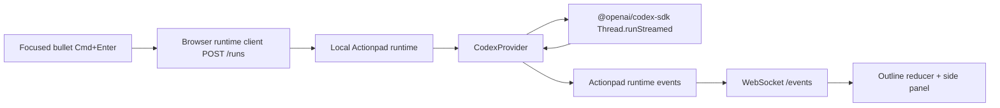

# Actionpad Real Codex Runtime Design

## Summary

Actionpad should make executable bullets run real local Codex tasks, not only deterministic fake-provider simulations. V1 targets the local desktop prototype: the web app remains the outline/editor, and a local Node runtime hosts a Codex SDK provider that controls the current project workspace through `@openai/codex-sdk`.

The goal is not to build every agent harness feature yet. The goal is to make one bullet execution genuinely run Codex, stream useful progress into the side panel, append validated outline output when Codex produces it, and expose failures clearly when auth, sandbox, or output parsing fails.

## Goals

- Run bullets through `@openai/codex-sdk` using local Codex auth and the current repository as the working directory.
- Stream Codex thread events into Actionpad’s existing runtime event protocol as the task runs.
- Preserve each bullet’s Codex thread identity so reopening a bullet shows the agent conversation and future follow-up work has a thread to resume.
- Convert Codex tool activity, command output, file changes, reasoning summaries, assistant messages, and failures into side-panel timeline events.
- Require Codex to emit a structured Actionpad outline patch and apply it only after validation.
- Keep fake runtime support as the deterministic QA/dev provider.
- Keep safety controls explicit: workspace, sandbox mode, approval policy, network access, model, and reasoning effort should be runtime configuration, not hidden defaults.

## Non-Goals

- No remote/cloud execution service.
- No multi-workspace picker yet.
- No persisted database for runs or threads beyond in-memory runtime state.
- No multi-agent scheduling, cancellation UI, or approval UI beyond surfacing approval-required events.
- No rich file browser, diff viewer, or terminal replay UI.
- No automatic context search across arbitrary outline nodes. The browser still sends the current outline snapshot and generated context string.
- No robust multi-turn follow-up chat yet, though the design must keep the thread mapping needed for it.

## Current State

The app already has a local runtime server with:

- HTTP `POST /runs`
- WebSocket `/events`
- shared `AgentProvider` interface
- fake provider
- browser runtime client
- reducer support for runtime events
- side panel timeline for messages, outline output, tools, and failures

The current Codex provider is only a skeleton. It calls `thread.run(...)`, waits for the final response, emits one assistant delta containing the whole final text, parses an `<actionpad-outline-output>` block, and emits an outline patch or failure. It does not stream real Codex events, map tool/file activity, preserve provider thread IDs, or expose local runtime configuration.

## Architecture

Actionpad keeps the same three-layer model:

1. **React app**: editor, outline state, side panel transcript.
2. **Runtime server**: HTTP command API plus WebSocket event stream.
3. **Agent providers**: fake provider and Codex provider behind the same interface.

The real Codex work happens entirely inside the runtime provider. The browser should not import Codex SDK or know Codex-specific event shapes. It should only receive Actionpad runtime events.



## Runtime Configuration

The runtime should default to fake provider for easy prototype runs unless explicitly configured for Codex.

Environment variables:

- `ACTIONPAD_PROVIDER=fake|codex`
- `ACTIONPAD_RUNTIME_PORT`, default `43217`
- `ACTIONPAD_WORKSPACE`, default `process.cwd()`
- `ACTIONPAD_CODEX_MODEL`, optional
- `ACTIONPAD_CODEX_REASONING`, optional, one of Codex SDK reasoning efforts
- `ACTIONPAD_CODEX_SANDBOX`, default `workspace-write`
- `ACTIONPAD_CODEX_APPROVAL`, default `on-request`
- `ACTIONPAD_CODEX_NETWORK`, default `false`
- `ACTIONPAD_CODEX_WEB_SEARCH`, default `disabled`

Invalid config should fail runtime startup with a clear console error rather than silently falling back.

## Provider Responsibilities

`CodexProvider` should own:

- Creating a Codex SDK client.
- Starting a thread with configured workspace/sandbox/model settings.
- Calling `runStreamed(...)` instead of `run(...)`.
- Mapping Codex SDK events to `AgentRuntimeEvent`.
- Tracking active run IDs to support cancellation.
- Tracking Actionpad thread IDs to Codex provider thread IDs.
- Extracting and validating outline output from final assistant content.
- Emitting `run-failed` if Codex fails, auth is missing, output is invalid, or the stream errors.

The provider should remain usable through the existing `AgentProvider` interface. If the interface needs to expose provider metadata, add it in a provider-neutral way rather than adding Codex-specific fields to app code.

## Event Mapping

Codex SDK event mapping should be deterministic and conservative.

`thread.started`:

- Store the Codex provider thread ID.
- Use it as `providerThreadId` on the Actionpad `run-started` event if available.

`item.started` / `item.updated` / `item.completed`:

- `agent_message`: create/update/complete assistant message.
- `reasoning`: store as a timeline event or system-style message. Keep summaries concise in UI.
- `command_execution`: emit `tool-started` on first in-progress item and `tool-completed` on terminal item, with command/output summarized.
- `mcp_tool_call`: emit tool started/completed with server/tool name and result/error summary.
- `file_change`: emit tool/event card describing changed files.
- `web_search`: emit tool/event card for the search query.
- `todo_list`: emit a timeline event only if needed later; V1 can ignore it unless it becomes useful in real Codex runs.
- `error`: emit `run-failed` only if the stream or turn cannot continue; otherwise surface as timeline error.

`turn.completed`:

- Mark assistant messages complete.
- Extract one Actionpad outline patch from the final assistant text.
- Emit `outline-patch` if valid.
- Emit `run-completed` after outline patch processing.

`turn.failed` or top-level `error`:

- Emit `run-failed` with the error message.

## Outline Output Contract

V1 continues to use the existing delimiter block:

```text
<actionpad-outline-output>
{ "type": "append-child-bullets", "parentId": "...", "bullets": [{ "text": "..." }] }
</actionpad-outline-output>
```

The provider prompt must instruct Codex to emit exactly one block at the end. Runtime parsing must:

- reject missing block
- reject invalid JSON
- reject invalid outline patches
- reject patches targeting a parent other than the executing bullet for V1
- reject blank child bullet text
- emit visible `run-failed` errors rather than applying malformed output

Structured output is a likely next step, but the first real milestone can keep the delimiter parser if the tests cover it.

## Prompt Contract

The Codex prompt should include:

- “You are running inside Actionpad, an executable outline.”
- The executing bullet ID and text.
- The outline context string from the browser.
- A compact outline snapshot summary if needed.
- Instructions that durable UI output must be an append-child-bullets patch under the executing bullet.
- A rule that normal working notes belong in the assistant response, while lasting outline output belongs in the Actionpad patch.

The prompt should not ask Codex to edit files unless the bullet asks for code changes. This is important because many Actionpad bullets will be planning/research/thinking tasks.

## Thread Identity

Actionpad currently creates app-side thread IDs in reducer/runtime events. The Codex provider must also record provider thread IDs.

V1 behavior:

- Runtime emits an Actionpad `threadId` for each new run.
- Runtime emits `providerThreadId` once Codex `thread.started` is observed.
- Reducer stores `providerThreadId` on the `AgentThread`.
- `CodexProvider.getThread(...)` can return in-memory snapshots for active/current runtime session only.

Follow-up chat can later use this mapping to resume a Codex thread through `codex.resumeThread(providerThreadId)`.

## Safety

The runtime should be explicit about local execution risk:

- Workspace defaults to the repo where `npm run runtime:dev` is launched.
- Sandbox defaults to `workspace-write`.
- Approval defaults to `on-request`.
- Network defaults off.
- Web search defaults disabled.
- Runtime startup logs the active workspace, sandbox, approval mode, network setting, provider, and port.

The browser UI can remain minimal for V1, but failures or approval-required events must appear in the side panel rather than disappearing.

## Testing

Required tests:

- Codex event mapper unit tests using mocked SDK event streams.
- Provider tests with a fake Codex client/thread, no real network or real Codex process.
- Parser tests for valid block, invalid JSON, invalid patch, wrong parent ID, and missing block.
- Runtime server tests proving provider events broadcast over WebSocket.
- Store/UI tests proving streamed assistant/tool/failure events render.

Manual smoke test:

- Start runtime with `ACTIONPAD_PROVIDER=codex`.
- Execute a bullet that asks for two child bullets.
- Confirm side panel receives assistant output.
- Confirm valid child bullets append.
- Confirm invalid output appears as failed run.

## Acceptance Criteria

- `ACTIONPAD_PROVIDER=codex npm run runtime:dev` starts without crashing when local Codex auth is configured.
- Cmd+Enter on a bullet starts a real Codex run.
- Side panel updates before the final response if Codex emits stream events.
- Command/tool/file-change activity appears as timeline events.
- A valid Actionpad outline block appends child bullets.
- Invalid or missing outline output fails visibly without mutating the outline.
- Fake provider remains available and deterministic.
- Automated tests do not require real Codex credentials.

## Open Follow-Ups

- Add follow-up chat messages for existing bullet threads.
- Add cancellation and approval UI.
- Add persisted run/thread history.
- Add user-selectable workspaces.
- Replace delimiter output with structured output if Codex SDK behavior is reliable enough for this use case.
- Add context search over outline nodes for agent-controlled context expansion.
